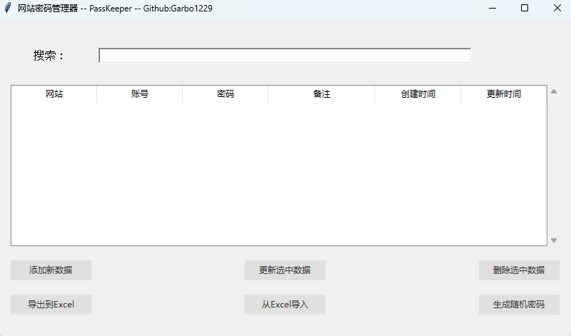

# 网站密码管理器 PassKeeper

### 项目背景
本项目是广州商学院 Python 课程的期末作业。
在有限的时间里，我选择了制作一个带图形化界面的小工具来管理网站密码，虽然初衷有些仓促，但最终完成了一个功能可用的密码管理器。

### 技术
- Python

- Tkinter（Python GUI库）

### 界面截图



### 功能列表
- [x] 网站密码管理：支持增删改查操作
- [x] Excel导出/导入
- [x] 随机密码生成
- [ ] 启动密码
- [ ] mysql同步
- [ ] Chrome 插件

后续功能将根据需要和时间逐步更新。

### 使用说明

**Windows**
1. 安装依赖：
    ```
   pip install -r requirements.txt
    ```
2. 运行程序：
    ```
   python main.py
    ```
    或直接运行 PassKeeper.exe 文件。

**Linux**
1. 安装依赖：
    ```
   pip install -r requirements.txt
    ```
2. 运行程序：
    ```
   python main.py
    ```